<a href="https://www.eirikbreen.com">
  <picture>
    <source media="(prefers-color-scheme: dark)" srcset="./header-dark.svg" />
    
  </picture>
</a>

  <a href="https://www.eirikbreen.com"><picture><source media="(prefers-color-scheme: dark)" srcset="./nav-site-dark.svg" /></picture></a> <a href="https://www.eirikbreen.com/blog"><picture><source media="(prefers-color-scheme: dark)" srcset="./nav-wrote-dark.svg" /></picture></a> <a href="https://github.com/ebreen"><picture><source media="(prefers-color-scheme: dark)" srcset="./nav-github-dark.svg" /></picture></a> <a href="https://www.linkedin.com/in/eirik-breen"><picture><source media="(prefers-color-scheme: dark)" srcset="./nav-linkedin-dark.svg" /></picture></a> <a href="mailto:me@eirikbreen.com"><picture><source media="(prefers-color-scheme: dark)" srcset="./nav-email-dark.svg" /></picture></a>

Linux, Kubernetes, and GitOps, often in PCI-DSS. I want the next person to see what changed and why.

After hours I follow sidequests: homelab, native apps, local models, coding agents. If it survives the weekend, it lands on [eirikbreen.com](https://www.eirikbreen.com).

<a href="https://www.eirikbreen.com/blog">
  <picture>
    <source media="(prefers-color-scheme: dark)" srcset="./wrote-dark.svg" />
    
  </picture>
</a>

<a href="https://www.eirikbreen.com/projects">
  <picture>
    <source media="(prefers-color-scheme: dark)" srcset="./projects-dark.svg" />
    
  </picture>
</a>

<picture>
  <source media="(prefers-color-scheme: dark)" srcset="./toolkit-dark.svg" />
  
</picture>
